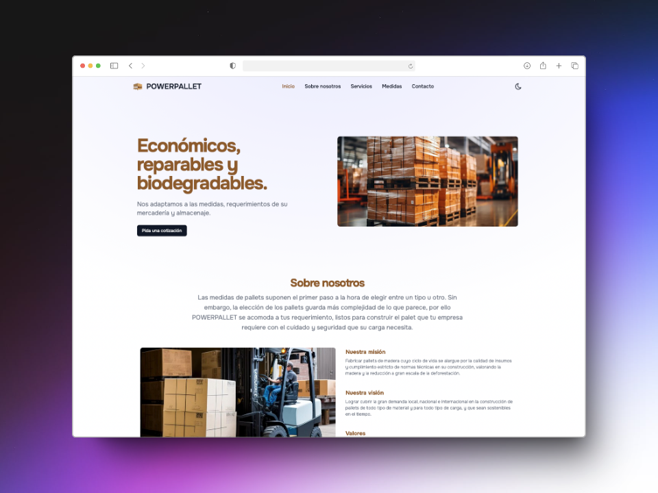

# PowerPallet.org - Página Web Oficial

Bienvenido al repositorio de la página web oficial de [PowerPallet](https://powerpallet.org). Esta página web está diseñada para promover los servicios y productos de PowerPallet, una empresa dedicada a la fabricación y venta de pallets de alta calidad, sostenibles y adaptados a las necesidades de sus clientes.

## 🌐 Descripción del Proyecto

El sitio web de PowerPallet ofrece información detallada sobre la empresa, incluyendo su misión, visión, valores, y una descripción de los servicios ofrecidos. La página está construida con [Astro](https://astro.build), un framework moderno que permite crear sitios web rápidos y eficientes.

<div align="center">
<a href="https://powerpallet.org">

</a>
<p></p>
</div>

<div align="center">


</div>

## 🚀 Estructura del Proyecto

La estructura del proyecto es la siguiente:

```text
/
├── public/
│   ├── favicon.svg
│   ├── img/
│   │   ├── europallet.png
│   │   ├── palletuniversal.png
│   │   └── otros recursos...
├── src/
│   ├── components/
│   │   ├── Header.astro
│   │   ├── Footer.astro
│   │   ├── About.astro
│   │   └── otros componentes...
│   ├── icons/
│   │   ├── DarkIcon.astro
│   │   ├── LightIcon.astro
│   │   └── otros íconos...
│   ├── layouts/
│   │   └── Layout.astro
│   └── pages/
│       ├── index.astro
│       └── otros archivos .astro...
└── package.json
